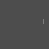

# Learning the Game of Pong through Reinforcement Learning and Value Functions
Pong is a classic Atari game in which a player controls a paddle and attempts to bounce a ball past their opponent's paddle. It is a simple game that has been widely used as a benchmark for reinforcement learning algorithms, including Deep Q-Networks (DQN).

In the context of reinforcement learning, the player's paddle can be seen as an agent that takes actions (moving the paddle up or down) in an environment (the game of Pong) in order to maximize a reward (winning the game). The agent receives a reward of +1 for winning the game, and a reward of -1 for losing the game.

One of the key challenges in training an agent to play Pong using reinforcement learning is designing an appropriate action space and reward function. In the case of Pong, the action space is relatively simple, as the agent can only move the paddle up or down. However, designing an appropriate reward function can be more challenging, as it is not always clear what the agent should be rewarded for.

DQN is a popular algorithm for training agents to play Atari games using reinforcement learning. It works by training a neural network to approximate the action-value function, which estimates the expected future reward for each action the agent can take in a given state. The agent then takes actions that maximize the expected reward, using the action-value function as a guide.

Overall, Pong is a simple yet challenging game that has been widely used to test and improve reinforcement learning algorithms.

# Directory Structure

The directory contains the following files:

- `agent.py`: Contains the implementation of the agent that will be trained to interact with the environment.
- `config.py`: Contains configuration parameters for the training process.
- `environment.py`: Contains the implementation of the environment that the agent will interact with.
- `eval.py`: Contains the code for evaluating the trained agent.
- `loss_function.py`: Contains the implementation of the loss function used to train the agent.
- `metrics.py`: Contains the code for calculating evaluation metrics for the trained agent.
- `net.py`: Contains the implementation of the neural network used by the agent.
- `replay_buffer.py`: Contains the implementation of the replay buffer used by the agent during training.
- `run.py`: Contains the code for training the agent.

# Environment Setup

To activate the environment for GPU, use the following command:

`conda env create -f conda_env.yml`

To activate the environment for CPU, use the following command:

`conda env create -f conda_env_cpu.yml`

# Training and Evaluation

To train the agent, use the following command:

`python run.py`

To evaluate the trained agent, use the following command:

`python eval.py`

